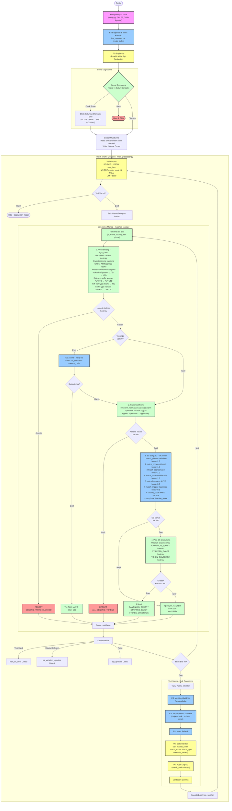

# Uygulama Akis Diyagrami

Bu diyagram, `main_processor.py` ve `matcher_logic.py` dosyalarindaki mantigi temel alarak uygulamanin calisma akisini gostermektedir.

```mermaid
graph TD
    %% Baslangic ve Konfigurasyon
    Start([Baslat])
    InitConfig["Konfigurasyon Yukle<br/>(config.py: DB, ES, Tablo Ayarlari)"]
    InitES["ES Baglantisi & Index Kontrolu<br/>(es_manager.py: create_index)"]
    InitDB["PG Baglantisi<br/>(Read & Write Ayri Baglantilar)"]

    Start --> InitConfig
    InitConfig --> InitES
    InitES --> InitDB

    %% Sema Dogrulama
    subgraph SchemaCheck [Sema Dogrulama]
        ValidateSchema{"Sema Dogrulama<br/>(Tablo ve Sutun Kontrolu)"}
        AddCols["Eksik Sutunlari Otomatik Ekle<br/>(ALTER TABLE ... ADD COLUMN)"]
        Error([Hata & Cikis])
    end

    InitDB --> ValidateSchema
    ValidateSchema -- Eksik Sutun --> AddCols
    AddCols --> InitCursor
    ValidateSchema -- Hata --> Error
    ValidateSchema -- Tamam --> InitCursor

    %% Veri Okuma Hazirligi
    InitCursor["Cursor Olusturma<br/>Read: Server-side Cursor Named<br/>Write: Normal Cursor"]
    InitCursor --> FetchData

    %% Batch Isleme Dongusu
    subgraph BatchLoop [Batch Isleme Dongusu - main_processor.py]
        direction TB
        FetchData["Veri Okuma<br/>SELECT ... FROM raw_data<br/>WHERE master_code IS NULL<br/>LIMIT 5000"]
        CheckEmpty{"Veri Var mi?"}
        Finish([Bitis - Baglantilari Kapat])

        FetchData --> CheckEmpty
        CheckEmpty -- Hayir --> Finish

        %% Satir Isleme Dongusu
        CheckEmpty -- Evet --> RowLoopState["Satir Isleme Dongusu Baslat"]
        RowLoopState --> ProcessRow["Her Bir Satir Icin:<br/>(id, name, country, tax, phone)"]

        subgraph RowLogic [Eslestirme Mantigi - matcher_logic.py]
            direction TB

            CleanData["1. Veri Temizligi - light_clean<br/>Zero-width karakter temizligi<br/>Parantez icerigi kaldirma<br/>C/O ve ATTN sonrasi kesme<br/>Ampersand normalizasyonu<br/>Nokta-harf pattern: L.T.D. → LTD<br/>Birlesmis suffix ayirma: PVTLTD → PVT LTD<br/>Cift-harf typo: INCC → INC<br/>Suffix typo haritasi: LIMTED → LIMITED"]

            GenericCheck{"Jenerik Kelime<br/>Kontrolu"}
            BlockGeneric["REDDET<br/>GENERIC_WORD_BLOCKED"]

            CheckTax{"Vergi No<br/>Var mi?"}
            SearchTax["ES Arama - Vergi No<br/>Filter: tax_number + country_code"]
            FoundTax{"Bulundu mu?"}
            MatchTax["Tip: TAX_MATCH<br/>Skor: 100"]

            CanonicalStep["2. Canonical Form<br/>synonym_normalizer.canonical_form<br/>Synonym kurallari uygula<br/>Apple Corporation → apple corp."]

            TokenCheck{"Anlamli Token<br/>Var mi?"}
            BlockTokens["REDDET<br/>ALL_GENERIC_TOKENS"]

            ESQuery["3. ES Sorgusu - 6 Katman<br/>1 match_phrase variations boost=2.0<br/>2 match_phrase stripped boost=1.5<br/>3 match operator:and boost=1.2<br/>4 match_phrase unidecode boost=1.0<br/>5 match fuzziness:AUTO boost=0.8<br/>6 match stripped fuzziness boost=0.6<br/>+ country_code HARD FILTER<br/>+ tax/phone function_score"]

            ESEmpty{"ES Sonuc<br/>Var mi?"}

            PostES["4. Post-ES Dogrulama<br/>Uzunluk orani kontrolu<br/>CANONICAL_EXACT kontrolu<br/>STRIPPED_EXACT kontrolu<br/>TOKEN_COVERAGE kontrolu"]

            MatchFound{"Eslesen<br/>Bulundu mu?"}
            MatchResult["Eslesti<br/>CANONICAL_EXACT / STRIPPED_EXACT<br/>/ TOKEN_COVERAGE"]
            NewMaster["Tip: NEW_MASTER<br/>Skor: 100<br/>Yeni UUID"]
            PrepResult["Sonuc Hazirlama"]

            ProcessRow --> CleanData
            CleanData --> GenericCheck
            GenericCheck -- Jenerik --> BlockGeneric
            GenericCheck -- Gecerli --> CheckTax

            CheckTax -- Evet --> SearchTax
            SearchTax --> FoundTax
            FoundTax -- Evet --> MatchTax
            CheckTax -- Hayir --> CanonicalStep
            FoundTax -- Hayir --> CanonicalStep

            CanonicalStep --> TokenCheck
            TokenCheck -- Hayir --> BlockTokens
            TokenCheck -- Evet --> ESQuery

            ESQuery --> ESEmpty
            ESEmpty -- Hayir --> NewMaster
            ESEmpty -- Evet --> PostES

            PostES --> MatchFound
            MatchFound -- Evet --> MatchResult
            MatchFound -- Hayir --> NewMaster

            MatchTax --> PrepResult
            MatchResult --> PrepResult
            NewMaster --> PrepResult
            BlockGeneric --> PrepResult
            BlockTokens --> PrepResult
        end

        %% Listelere Ekleme
        AddToLists["Listelere Ekle"]
        ListNew["new_es_docs Listesi"]
        ListVar["es_variation_updates Listesi"]
        ListSQL["sql_updates Listesi"]
        NextRow{"Batch Bitti mi?"}

        PrepResult --> AddToLists
        AddToLists --> |Yeni Kayit| ListNew
        AddToLists --> |Mevcut Eslesen| ListVar
        AddToLists --> |Tumu| ListSQL

        AddToLists --> NextRow
        NextRow -- Hayir --> ProcessRow

        %% Toplu Yazma Islemleri
        subgraph WriteLogic [Veri Yazma - Bulk Operations]
            direction TB
            BatchWriteStart["Toplu Yazma Islemleri"]
            ESBulkNew["ES: Yeni Kayitlari Ekle<br/>(helpers.bulk)"]
            ESBulkVar["ES: Varyasyonlari Guncelle<br/>(helpers.bulk - update script)"]
            ESRefresh["ES: Index Refresh"]
            DBUpdate["PG: Batch Update<br/>SET master_code, match_score, match_type<br/>(execute_values)"]
            AuditLog["PG: Audit Log Yaz<br/>(match_audit tablosu)"]
            DBCommit["Veritabani Commit"]

            BatchWriteStart --> ESBulkNew
            ESBulkNew --> ESBulkVar
            ESBulkVar --> ESRefresh
            ESRefresh --> DBUpdate
            DBUpdate --> AuditLog
            AuditLog --> DBCommit
        end

        NextRow -- Evet --> BatchWriteStart
        DBCommit --> ReadNextBatch["Sonraki Batch Icin Hazirlan"]
        ReadNextBatch --> FetchData
    end

    classDef config fill:#f9f,stroke:#333,stroke-width:2px;
    classDef db fill:#ff9,stroke:#333,stroke-width:2px;
    classDef es fill:#9cf,stroke:#333,stroke-width:2px;
    classDef logic fill:#cfc,stroke:#333,stroke-width:2px;
    classDef error fill:#f99,stroke:#333,stroke-width:2px;

    class InitConfig config;
    class InitDB,FetchData,DBUpdate,AuditLog,DBCommit db;
    class InitES,SearchTax,ESQuery,ESBulkNew,ESBulkVar,ESRefresh es;
    class ValidateSchema,ProcessRow,CleanData,CanonicalStep,PostES,MatchTax,MatchResult,NewMaster logic;
    class Error,BlockGeneric,BlockTokens error;
```
