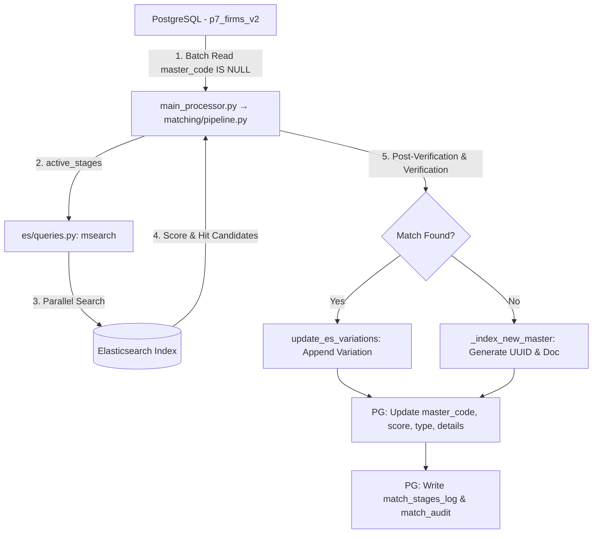

# Firma Eşleştirme ve Tekilleştirme Sistemi (Company Matching & Deduplication Engine)

Büyük ölçekli firma verilerini (isim, vergi numarası, telefon, adres vb.) analiz ederek benzersiz "Master" kayıtlarla eşleştiren, kendi kendini eğiten (yeni yazım varyasyonlarını öğrenen) ve Elasticsearch gücünü kullanan akıllı bir eşleştirme motorudur.

---

## 1. Giriş & Temel Prensipler (Core Principles)

Sistem aşağıdaki temel mantık ve kurallar çerçevesinde çalışır:

1.  **Ülke İzolasyonu (Strict Country Filter - HARD FILTER) [CRITICAL]**:
    Farklı ülkelerdeki firmalar asla eşleştirilemez. Ülke kodu (`country_code`) en kritik "Hard Filter" kriteridir. Arama, indeksleme ve doğrulama süreçlerinin tamamı fiziksel per-country indeks izolasyonu ile yapılır. Her ülke kendi indeksine (`living_companies_<cc>_v3`) ve alias'ına (`living_companies_<cc>`) sahiptir; `_routing` KULLANILMAZ.
2.  **Kendi Kendini Eğiten Sistem (Self-Learning Variations Loop)**:
    Sisteme giren her yeni geçerli eşleşme, Elasticsearch'teki ilgili master dokümanın `variations` listesine dinamik olarak eklenir. Böylece sistem zamanla daha zeki hale gelir ve gelecekteki alternatif yazımları otomatik yakalar.
3.  **Deterministik vs. Olasılıksal Eşleşme**:
    *   **Deterministik (Kesin)**: Vergi numarası (`tax_number`) eşleşmesi 'Exact Match' olarak kabul edilir ve post-verification gerektirmeden direkt 100 skorla eşleşir (`TAX_EXACT`).
    *   **Olasılıksal (İsim Benzerliği)**: Firma adı benzerlikleri Elasticsearch Analyzer'ları (fingerprint, ngram, phonetic) ve Painless rescore scriptleri ile değerlendirilir.
4.  **First Meaningful Token Limit**:
    Firma adının ilk anlamlı kelimesi (`_first_meaningful_token`) eşleşen iki kayıt arasında birebir eşit olmak zorundadır. Örneğin: `Kay Bee Corp` ile `Bee Kay Corp` veya `Kay A.S.` ile `Bay A.S.` eşleşemez.

---

## 2. Kurulum ve Altyapı (Installation & Setup)

### 1. Python Bağımlılıkları
```bash
pip install -r requirements.txt
```

### 2. Elasticsearch Plugin'leri (Önerilen)
Yüksek kaliteli eşleştirmeler için aşağıdaki ES eklentilerinin kurulu olması şarttır:
```bash
# ICU plugin: Unicode normalizasyon ve Latin folding (latinize() yerine)
elasticsearch-plugin install analysis-icu

# Phonetic plugin: Fonetik benzerlik (transliterasyon varyantları)
elasticsearch-plugin install analysis-phonetic
```
*Not: Eklentiler yoksa sistem otomatik olarak default `standard` analyzer'a ve phonetic tier'ları kapatmaya yönelik graceful fallback yapar.*

### 3. PostgreSQL Şeması
```bash
psql -d market_calculus -f schema.sql
```
*`config.py` içerisindeki `DB_CONFIG` verilerini kendi ortamınıza göre düzenleyin.*

---

## 3. System Architecture & Workflows

Below is the complete end-to-end data pipeline between PostgreSQL and Elasticsearch.



### Batch Operations and Within-Batch Deduplication
To prevent multiple identical companies within the same batch from receiving different master UUIDs, the system employs **Row-by-Row matching within batches**:
1.  Unmatched records are processed, and if no match is found, they are routed to `NEW_MASTER`.
2.  `NEW_MASTER` creation runs in sub-batches of size `200` (`NEW_MASTER_SUBBATCH_SIZE`).
3.  Each sub-batch is indexed into ES and an index `refresh` is called immediately.
4.  Remaining records in the batch are then queried against ES using `CANONICAL_EXACT` to see if they match the newly created masters before they are also treated as new masters.

---

## 4. Elasticsearch Index Configuration

*   **Per-Country Indices**: Each country has its own physical index (`living_companies_<cc>_v3`) with an alias (`living_companies_<cc>`). All reads/writes go through the alias. Invalid or unknown country codes (not a 2-letter code with a corresponding synonyms_data JSON file) are marked `EXCLUDED` with reason `invalid_country` and not indexed. Routing is **not used** — country isolation is achieved via physical index separation.
*   **Ingest Pipeline (`es/ingest.py`)**: Before indexing, a Painless script automatically applies lowercase, removes zero-width characters, cleans labels (`attn:`, `c/o`), and normalizes ampersands (`&` to `and`).

### Custom Analyzers
1.  **`clean_analyzer_{CC}`**: Tokenizes, normalizes, and applies country-specific synonyms (immutable list in `synonyms_data/`).
2.  **`fingerprint`**: Normalizes case, removes punctuation, sorts tokens, and removes duplicates. Useful for order-insensitive match.
3.  **`ngram_analyzer`**: Trigram tokenization (3-4 grams) for index-time fuzzy backstop.
4.  **`phonetic_analyzer`**: Double Metaphone translation for phonetic resilience.

---

## 5. The 7-Tier Matching Stage Hierarchy

The engine executes queries stage-by-stage inside a single `msearch` packet. The first stage that yields a score >= `min_score` is short-circuited as the winner.

| Order | Stage Name | Query Type (`es/queries.py`) | Min Score | Description |
| :---: | :--- | :--- | :---: | :--- |
| **1** | `TAX_EXACT` | Deterministic exact match on `tax_number` + `country_code`. | `100.0` | Exact verification. Short-circuits post-verify. |
| **2** | `CANONICAL_EXACT` | `match_phrase` on canonical variations. | `3.0` | Order-sensitive exact canonical matching. |
| **3** | `STRIPPED_EXACT` | `match_phrase` on stripped variations (suffix-free). | `3.0` | Suffix-independent exact matching. |
| **4** | `ADDRESS_CLEAN_MATCH` | Matches after address leakage regex clean. | `3.0` | Cleaned name matching. |
| **5** | `SUBSET_MATCH` | Matches subsets of tokens using ES query. | `1.5` | Suffix fuzzy match threshold. |
| **6** | `EXACT_FUZZY` | Fuzzy match on exact names. | `3.0` | Small typo tolerance on core name. |
| **7** | `TOKEN_COVERAGE` | Free word order token match. | `3.0` | Validates against `TOKEN_COVERAGE_THRESHOLD` (95%). |

---

## 6. CLI Command Cheat Sheet

| Operation | Command | Purpose |
| :--- | :--- | :--- |
| **Start Process** | `python main_processor.py` | Run deduplication on all remaining records. |
| **Force Re-indexing** | `python -m es.manager --force` | Re-create ES Index, mapping, and analyzers. |
| **Ingest Register** | `python -m es.ingest` | Refresh Ingest Painless clean scripts. |
| **Full Reset** | `python -m tools.reset_matching` | Clear PostgreSQL and Elasticsearch to start from scratch. |
| **Postgres-Only Reset** | `python -m tools.reset_matching --pg` | Reset DB match fields but keep Elasticsearch indices intact. |
| **ES-Only Reset** | `python -m tools.reset_matching --es` | Reset Elasticsearch indices only. |
| **Duplicate Reviewer** | `python -m dedup.reviewer` | Interactive console tool to review & merge potential duplicates. |
